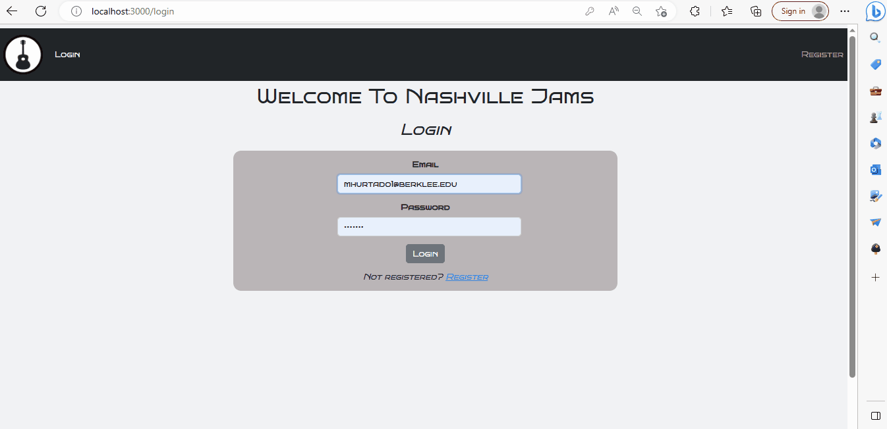
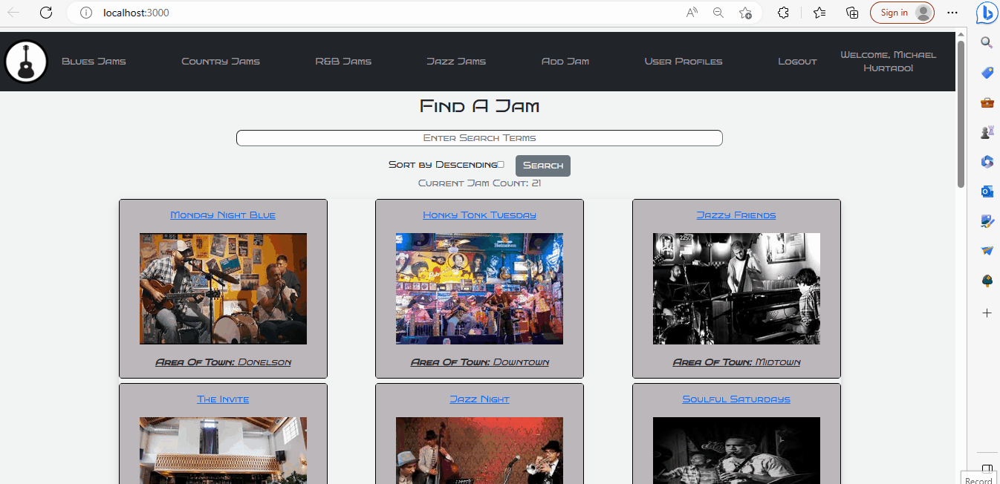
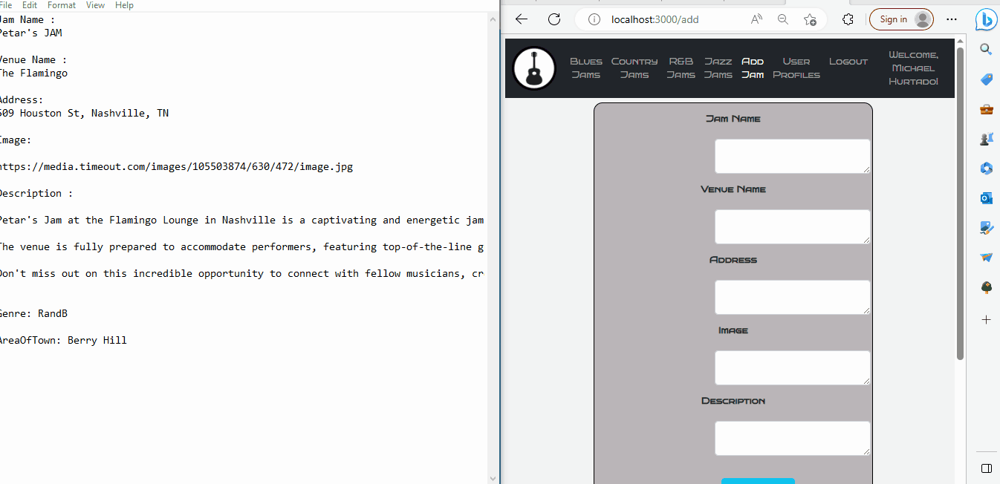
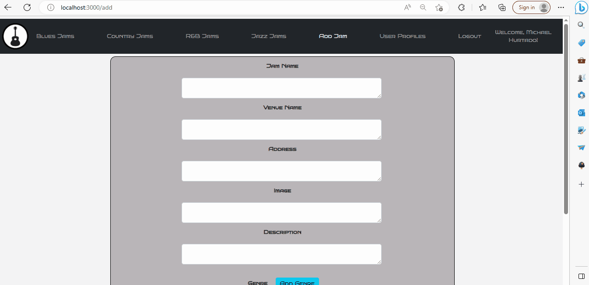

# NashvilleJams

Nashville Jams is a web application built with C#, React, Reactstrap, Firebase, and SQL Server. It allows users to sign in or register, view a list of jams happening in Nashville on the homepage, and access detailed information about each jam. The app also provides editing and deleting capabilities for the jam's creator or the admin. Additionally, the app offers genre filtering, allowing users to explore the most popular jam genres in Nashville. Users can also add new jams, genres, and areas of town. The website also includes a list of user profiles and their favorite genres.
Features

   - User Authentication: Users can sign in or register to access the app's functionalities.
   - Homepage: The homepage displays a list of jams happening in Nashville.
   - Jam Details: Clicking on the title of a jam on the homepage takes users to a details page, where they can view more information about the jam. The person who added the jam or the admin can          edit and delete the jam from this page.
   - Genre Filtering: The navbar allows users to filter jams by the most popular genres in Nashville, including blues, jazz, country, and R&B.
   - Add New Jam: Users can add a new jam to the database. If the genre of the jam is not in the existing genres list, users can add a new genre.
   - Add New Area of Town: Users can also add a new area of town to provide more specific location information for jams.
   - User Profiles: The website lists user profiles and their favorite genres.

## Technologies Used

   - C#: The backend of the application is built using C#.
   - React: The frontend is developed using the React library.
   - Reactstrap: Reactstrap is used to create responsive and mobile-friendly user interfaces.
   - Firebase: Firebase is utilized for user authentication and data storage.
   - SQL Server: SQL Server is used as the database to store jams, genres, areas of town, user profiles, and favorite genres.

## WireFrames

`` - https://dbdiagram.io/d/644554aa6b319470510d1315

## Installation

   - Clone down this repository.
   - Ensure node and npm are installed on your machine.
 
 ## Demo
 
- Login and Register 
- 
- Homepage Details
- 
- Homepage searchbar
- 
- Filtered Jam
- 
- Add Jam, Add Genre
- 
- 
- User Profiles 
- 
